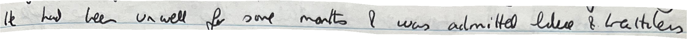
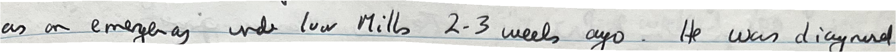

# OCR Model Comparison

All of the models below were trained on a limited pilot corpus of around **1,300 line crops** from the diary.  
This smaller sample was intentionally used to estimate how well each model might perform once scaled to a full training set.  
Since producing high-quality annotated data was time-consuming, the goal was to get an early performance signal.  

Typically, OCR models are trained on **3,000–5,000 samples** to reach good performance.  
Despite the limited data, the models performed better than expected.

---

## Google Cloud Vision

One of the leading OCR systems, but it produced relatively weak results on our handwriting domain.  
This model does not support fine-tuning, which likely contributed to the lower performance.

**Example Outputs:**

| Image | Prediction |
|-------|------------|
|  | `strom condidate to be this Vice Chanceller!!!` |
|    | `He had Unwell some mailt Imilted libere & kaltilen` |
|    | `2-3 weeks was drayne emere` |

These results highlight the difficulty of the problem domain compared to standard OCR tasks.

---

## Tesseract OCR

A widely used open-source OCR engine in both research and production.  
It allows for fine-tuning, and I performed a small, limited domain-specific training.

**Example Outputs:**

| Image | Prediction |
|-------|------------|
|  | `I woud he a strong candicdade ts ee ther Wie Chancellor!` |
|    | `te had been unwell fer sont months & wis aclmithed Lilece & he thle` |
|    | `[DID NOT OUTPUT]` |

Although Tesseract is often effective on handwriting when adapted, its performance here was limited.

---

## TrOCR

A transformer-based OCR model developed by :contentReference[oaicite:1]{index=1}, usually used in situations where fine-tuning on custom datasets is needed.  
Unfortunately, it resizes all images to **128×128** due to its rigid architecture, which restricted fine-tuning performance.  
Despite this, it still gave some good results.

**Example Outputs:**

| Image | Prediction |
|-------|------------|
|  | `I be be strong to to to their Chancellor` |
|    | `He been unwell some & admitted blue blue blue breath &less` |
|    | `as emergency low under Mills-3 ago ago He diagnosed` |

> Note: The repeated words are due to the resizing of training data from ~2200×130 → 128×128.  
> If I had moved forward with this model, I would have designed the crop sizes to fit what the model expects.

---

## PaddleOCR

The most promising model after fine-tuning.  
This transformer-based approach outputs characters individually, which makes raw transcriptions look noisier.  
However, when passed through a language model, its results surpassed all other models.  

The training framework was also more flexible. By removing batch normalization from the training code and replacing it with pretrained batch norm parameters, as well as introducing noise and distortions to augment the training corpus, I achieved a significant boost in performance.

**Example Outputs:**

| Image | Prediction |
|-------|------------|
|  | `I woudd be a shry candidate to be thei Vite Chanellar!` |
|    | `Hw had beer unwell fr some mants & was admitted ldee & beathless` |
|    | `as an emergeray ud loo Mills 2-3 weels ago. e wa diagnerd` |

Considering the character-by-character transcription flaws that are easily mitigated using NLP, and the small dataset, these results were very promising.

---

## Conclusion

In the end, we went with another **third-party model** despite the good results, because all of these OCR models do not use the **surrounding context (previous words)** to determine predictions.  

On such a difficult dataset, many phrases/words were impossible to transcribe without context.  
The model we ultimately chose uses context, and thus would always outperform these models regardless of how much fine-tuning was performed.
